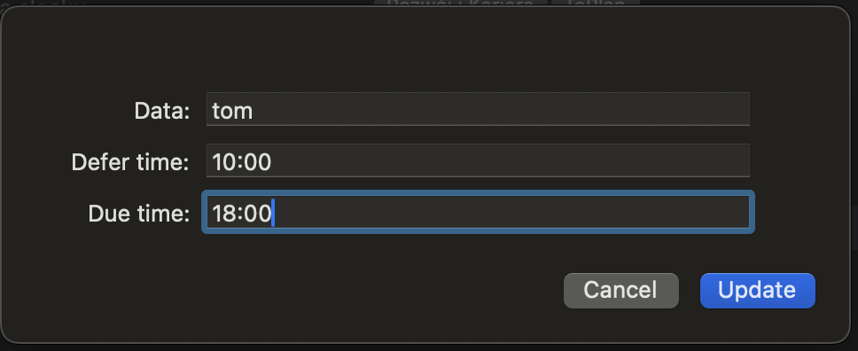

# Update Dates and Time

Update date, defer time, and due time in selected tasks. In the date field, you can put the date or shortcut date(+1 day, +1 week, +1 month, +1 year, 2d, –3w, 1h, 1y).

[Install plug-in](omnifocus:///omnijs-install?path=https://github.com/mmaer/omnifocus-scripts/raw/main/scripts/updateDatesAndTime/updateDatesAndTime.zip)\
[Plug-In code](https://github.com/mmaer/omnifocus-scripts/blob/main/scripts/updateDatesAndTime/updateDatesAndTime.omnifocusjs)

### Screenshots

## In the future

- [ ] Update date field to handle date for due date and defer date separately
- [ ] Handle date field type for dates
