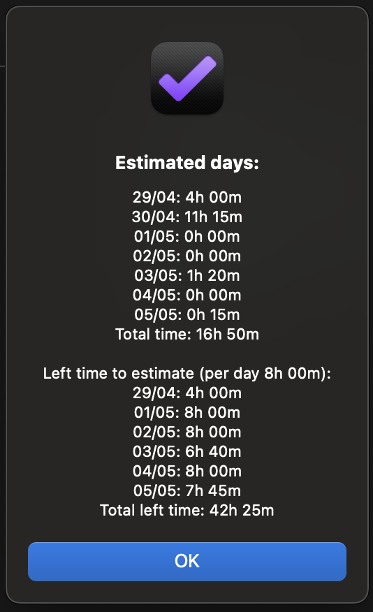

# Estimate days

Estimate days plug-in can help with better planning days by seeing the total estimated time and how much time is left to estimate per day. You just need to select a predefined date range or select your ones to get an estimated time in the given date range.

[Install plug-in](omnifocus:///omnijs-install?path=https://github.com/mmaer/omnifocus-scripts/raw/main/scripts/estimateDays/estimateDays.zip)\
[Plug-In code](https://github.com/mmaer/omnifocus-scripts/blob/main/scripts/estimateDays/estimateDays.omnifocusjs)

### Screenshots

### Settings

By pressing `option` key you can define `Time in minutes to estimate per day` e.g 600 (10h).

## Changelog

### 1.2.0
- This month in predefined dates
- Next month in predefined dates
- New option: show/hide days with 0 minutes
- New option: show/hide sundays

## In the future
- [ ] Estimate morning, afternoon and evening each day
