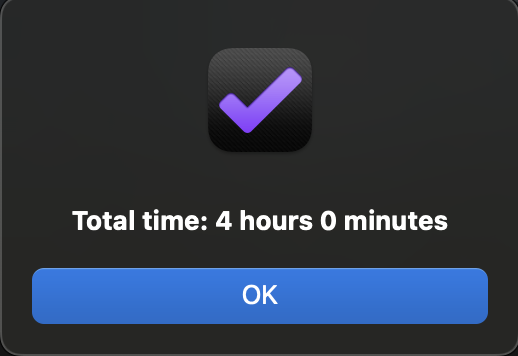

# Estimate Time

Get the total estimated time by selecting tasks and projects and running the Estimate time plug-in.

[Install plug-in](omnifocus:///omnijs-install?path=https://github.com/mmaer/omnifocus-scripts/raw/main/scripts/estimateTime/estimateTime.zip)\
[Plug-In code](https://github.com/mmaer/omnifocus-scripts/blob/main/scripts/estimateTime/estimateTime.omnifocusjs)

### Screenshots

## In the future

- [ ] Display how much each selected tag is estimated
