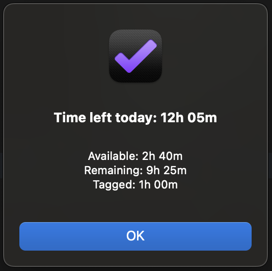

# Left time today

Left time today plug-in displays how much time is left today.

Total time left: How much estimated time left today (Available and remaining today tasks are counted).
Available: Count today's estimated tasks whose status is due soon.
Remaining: Count today's estimated tasks whose status is not due soon.
Tagged: Count today's estimated tasks that are tagged (Count only tasks which due date is today).

Get information about how much time is left today.

[Install plug-in](omnifocus:///omnijs-install?path=https://github.com/mmaer/omnifocus-scripts/raw/main/scripts/leftTimeToday/leftTimeToday.zip)\
[Plug-In code](https://github.com/mmaer/omnifocus-scripts/blob/main/scripts/leftTimeToday/leftTimeToday.omnifocusjs)

### Screenshots

## In the future

- [ ] Display how much each selected tag is estimated
